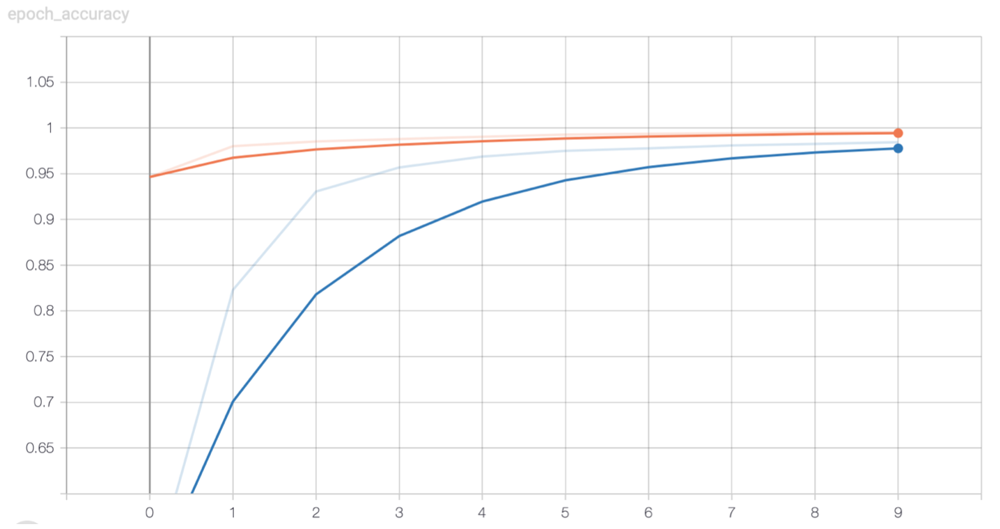
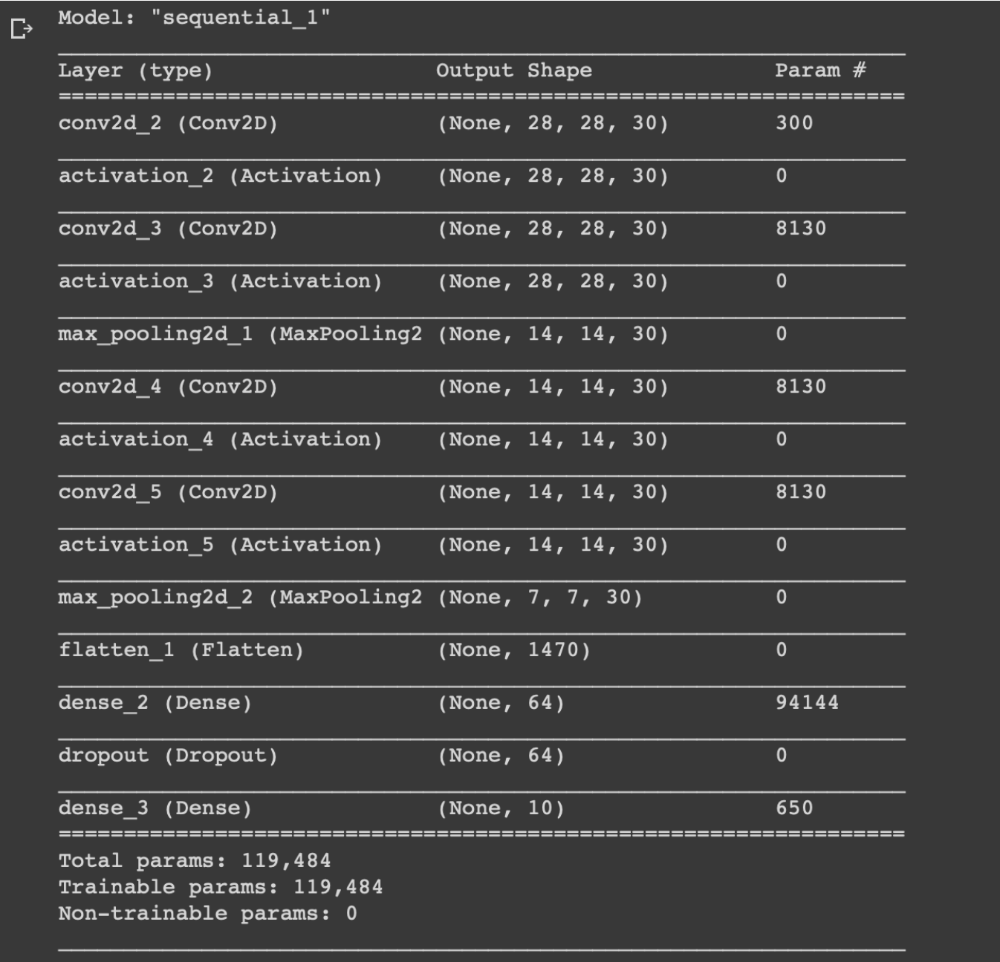
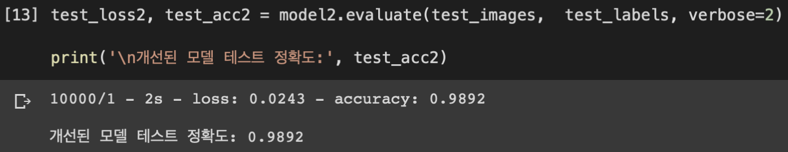

## Hand Letter Recognition AI Model (손 글씨 인식 AI 모델)

&nbsp;&nbsp;&nbsp;&nbsp;&nbsp;&nbsp;&nbsp;&nbsp;&nbsp;&nbsp;&nbsp;&nbsp;&nbsp;&nbsp;&nbsp;&nbsp;&nbsp;&nbsp;&nbsp;&nbsp;&nbsp;&nbsp;&nbsp;&nbsp;&nbsp;&nbsp;&nbsp;&nbsp;&nbsp;&nbsp;&nbsp;&nbsp;&nbsp;&nbsp;&nbsp;&nbsp;&nbsp;&nbsp;&nbsp;&nbsp;&nbsp;&nbsp;&nbsp;&nbsp;&nbsp;&nbsp;&nbsp;&nbsp;&nbsp;&nbsp;&nbsp;&nbsp;&nbsp;&nbsp;&nbsp;&nbsp;&nbsp;&nbsp;&nbsp;&nbsp;*2019-2 인공지능 연구 과제*

**손 글씨 인식 CNN 모델을 구현하고,**

**모델을 정확도의 측면에서 개선할 방법이 있는지를 고려하여 개선 모델을 제안하였습니다.**

**자세한 내용은 report.pdf 파일을 확인해주세요.**

 

- **사용한 언어 및 도구, 라이브러리**
  + Python3
  + Tensorflow
  + Keras

 

+ **개발 환경**
  + macOS Catalina
  + Google Colab

 

- **TensorBoard로 시각화한 학습 과정**

  </img>
  
  
  
- **개선한 모델의 각 층에 대한 정보**

  </img>

  

- **개선된 모델의 테스트 정확도**

  </img>

---

> 2020.1.3 최종 업데이트
>
> 광운대학교 소프트웨어학부 윤홍찬

